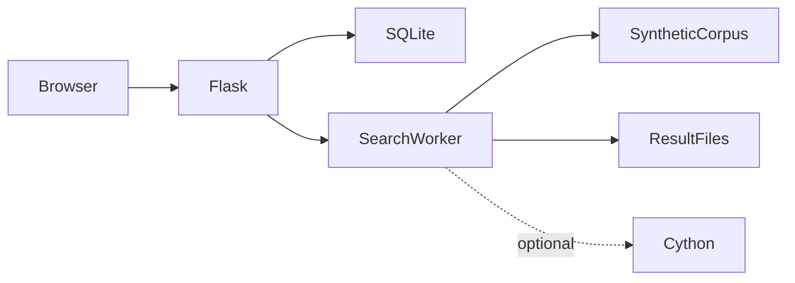

# البحث النصي المحلي

**بحث في مجموعات محلية بوظائف خلفية**

[English](README.md)

البحث غير المتزامن في الملفات المحلية وعرض التقدم وتصفح النتائج وتنزيلها.

**التقنيات:** Python · Flask · SQLite · mmap · optional Cython

## الحالة والتاريخ

تطبيق معالجة مجموعات نصوص محلية وإدارتها. يستخدم العرض نصوصاً مولدة فقط.

هذه نسخة عرض منقحة للنشر. تعرض [وثيقة التحقق](docs/verification.md) الفحوص الحالية بصورة مستقلة عن النشر السابق.

## الوظائف والإجراءات

- مسح نصوص عبر mmap وتنفيذ Python بديل
- تسريع Cython اختياري
- تقدم الوظائف وكتابة دفعات النتائج إلى ملفات
- صفحات نتائج وتنزيل وفحص ملكية
- إدارة مستخدمين وإحصاءات استخدام
- إدخال Telegram اختياري معطل افتراضياً

ينشئ المستخدم بحثاً بعد الدخول ← يمسح العامل المجموعة الاصطناعية ← تُحدَّث الوظيفة والنتائج ← يتصفح المالك أو ينزل النتائج ← تراجع الإدارة الاستخدام.

## البنية

## القرارات الهندسية

- تُضبط مسارات المجموعة والقاعدة والنتائج من وحدة واحدة بدلاً من مجلد Downloads خاص بجهاز. تستخدم المصادقة والواجهة القاعدة نفسها.
- يتجنب mmap تحميل الملف كله كنص Python. خفض حالة حروف البايتات ليس معالجة Unicode شاملة.
- يستخدم Windows مسار الخيوط وتبقى شيفرة تعدد العمليات للمنصات الأخرى. تُوصف النتائج حسب النظام المقاس.
- فُصلت حزم Telegram والتسريع عن تثبيت Flask الأساسي لتفعيلها بقصد.
- يحفظ متغير بيئة مفتاح الجلسة؛ توليد مفتاح جديد عند التشغيل يبطل الجلسات السابقة.

## المجلدات

| Component | Responsibility |
|---|---|
| `app.py` | Flask routes, job orchestration and result views |
| `search_engine.py` | mmap scanning and worker selection |
| `database.py` | SQLite users/jobs/results metadata |
| `auth.py` | bcrypt and role helpers |
| `search_engine_cython.pyx` | Optional accelerated matching |
| `bootstrap_demo.py` | Synthetic corpus/admin bootstrap |

## التثبيت والإعداد

أنشئ بيئة Python وثبّت requirements.txt ثم صدّر متغيرات .env.example وشغّل bootstrap_demo.py وrun.py. لا يقرأ Python ملف .env تلقائياً. للتسريع ثبّت متطلباته ونفذ build_ext بمترجم C صالح. يتطلب Telegram حزمه وENABLE_TELEGRAM=1 ويظل معطلاً في العرض.

توجد أوامر التشغيل ومتغيرات البيئة في [دليل الإعداد](docs/setup.ar.md). القيم أمثلة محلية أو حقول فارغة؛ لا تعِد استخدام بيانات إنتاج سابقة.

## العرض والتحقق

ينشئ المستخدم بحثاً بعد الدخول ← يمسح العامل المجموعة الاصطناعية ← تُحدَّث الوظيفة والنتائج ← يتصفح المالك أو ينزل النتائج ← تراجع الإدارة الاستخدام.

استخدم حسابات وسجلات اصطناعية. راجع [خطوات العرض](docs/demo.ar.md) وسجل نتائج الفحوص الحالية. نجاح بناء مكون لا يثبت نجاح كل مسارات المنتج.

## الحدود

لا ندعي تسريعاً غير مقاس أو معالجة تيرابايت. يتطلب التسريع مترجماً. يحتاج التعافي من وظائف منقطعة والأنظمة الأخرى إلى فحوص مستقلة.

## التوثيق

- [البنية](docs/architecture.ar.md)
- [الإعداد](docs/setup.ar.md)
- [العرض](docs/demo.ar.md)
- [المسارات](docs/api.md)
- [الفحوص الحالية](docs/verification.md)
- [النشر وحل المشكلات](docs/deployment.md)
- [حقوق الأصول](THIRD_PARTY_NOTICES.md)

## المساهمة والترخيص

افتح مشكلة تتضمن خطوات إعادة الإنتاج والمكون المعني. استخدم بيانات اصطناعية وتعديلات مركزة وفحوصاً مناسبة، ولا ترسل أسراراً أو سجلات مستخدمين خاصة. الشيفرة بترخيص [MIT](LICENSE)، وتحتفظ الاعتماديات والأصول الخارجية بشروطها الأصلية.
