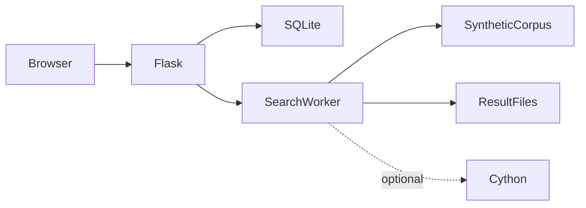
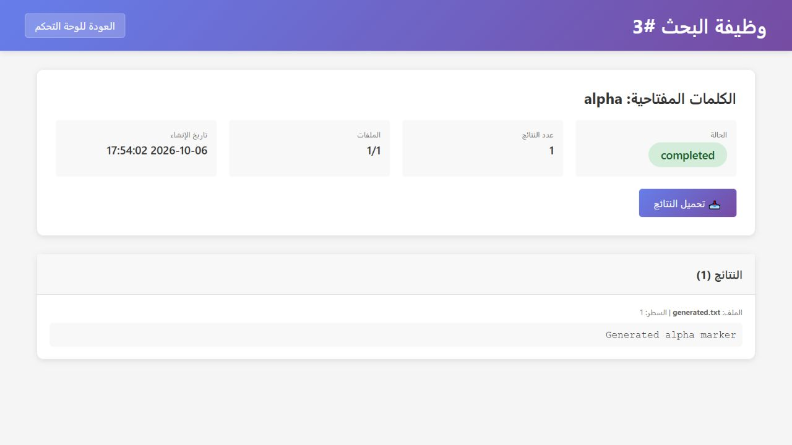

# Local Text Search

**Local corpus search with background jobs**

[العربية](README.ar.md)

Search local text files asynchronously and let users inspect progress, paginate matches and download output.

**Technology:** Python · Flask · SQLite · mmap · optional Cython

## Status and deployment history

Local corpus-processing and administration application. Public demos use generated text only.

This is a sanitized portfolio release. See the current [verification record](docs/verification.md) before choosing a runtime demonstration.

## Main workflows and implemented features

- Memory-mapped text scanning and Python fallback
- Optional Cython acceleration
- Background job progress and batched result-file writes
- Result pagination/downloads and owner checks
- User/admin management and usage statistics
- Optional Telegram ingestion, disabled by default

Authenticated user creates a search → worker scans configured synthetic corpus → job progress and output file are updated → owner browses/downloads results → administrator reviews usage.

## Architecture

## Engineering decisions

- Corpus, database and output directories resolve through one module instead of the old machine-specific Downloads path. Authentication and web handlers must use the same database.
- mmap avoids loading each entire file into a Python string. Case-insensitive matching currently lowers byte strings; this is not general Unicode case folding.
- Windows uses the threaded worker path; other platforms retain multiprocessing-related code. Describe measured behavior on the tested OS.
- Optional Telegram and acceleration packages are split from the minimal Flask install. Enabling one integration should be deliberate.
- Session secrets can persist through an environment value; generating a new key at restart invalidates existing sessions.

## Directory guide

| Component | Responsibility |
|---|---|
| `app.py` | Flask routes, job orchestration and result views |
| `search_engine.py` | mmap scanning and worker selection |
| `database.py` | SQLite users/jobs/results metadata |
| `auth.py` | bcrypt and role helpers |
| `search_engine_cython.pyx` | Optional accelerated matching |
| `bootstrap_demo.py` | Synthetic corpus/admin bootstrap |

## Installation

Create a Python virtual environment, install `pip install -r requirements.txt`, export the variables in `.env.example`, run `python bootstrap_demo.py`, then `python run.py`. Python does not automatically load `.env`; export values in your shell. For acceleration install `requirements.acceleration.txt` and run `python setup.py build_ext --inplace` with a working C compiler. Telegram requires `requirements.telegram.txt` and explicit `ENABLE_TELEGRAM=1`; it remains disabled for demos.

All required/private configuration is described in [setup](docs/setup.md). Examples contain placeholders or local demo values. Never reuse historical credentials.

## Demonstration

- Bootstrap a synthetic corpus and administrator.
- Search for demo, watch progress, paginate and download matches.
- Create another user and reject access to the first user’s job.
- Compare Python/accelerated results when the native module is available; record encoding and limit behavior.

## Verification and limitations

- Python syntax and Flask owner/role checks
- Search results, zero matches and result files
- Mixed encoding/long-line/limit behavior
- Acceleration equivalence only when compiler/module available

No unsupported speedup or terabyte-scale claim. Native acceleration needs a compiler. Interrupted-job recovery and non-Windows behavior require their own checks.

## Documentation

- [Architecture](docs/architecture.md) · [العربية](docs/architecture.ar.md)
- [Setup and configuration](docs/setup.md) · [العربية](docs/setup.ar.md)
- [Demo walkthrough](docs/demo.md) · [العربية](docs/demo.ar.md)
- [API and execution paths](docs/api.md)
- [Verification record](docs/verification.md)
- [Deployment and troubleshooting](docs/deployment.md)
- [Asset attribution](THIRD_PARTY_NOTICES.md) · [MIT license](LICENSE)

## Contributing

Open an issue describing a reproducible problem, expected behavior and component involved. Use synthetic data. Keep changes focused and include relevant checks. Do not include credentials or private user records.

## License and attribution

Source code is MIT licensed. Third-party dependencies and assets retain their own terms; see [attribution](THIRD_PARTY_NOTICES.md).

<!-- release-presentation -->

## Actual application interface

Captured from the local application with synthetic records. This does not establish production usage or Android device verification.

## Verification and deeper reading

All six Python regression/access tests passed: long lines and AND matching, zero/mixed-byte cases, a shared result budget across files, job ownership, unauthenticated search, and a 1,000-line matching regression. A measured Windows Python-only benchmark found exactly 800 matches in 800,000 generated lines (36,353,960 bytes); three runs took 10.2452, 10.9746 and 10.5983 seconds. OS caches were not flushed.

Cython equivalence, Linux worker behavior and interrupted-job recovery remain unverified. Included benchmark is Python-only on the documented Windows machine, not a speedup comparison. Optional Telegram ingestion is disabled for demos.

- [Case study](docs/case-study.md)
- [Verification](docs/verification.md)
- [Architecture diagram](docs/architecture.svg)
- [Portfolio case study](https://mohamedabderrehmane.netlify.app/projects/local-text-search/)

- [Engineering details and implementation lessons](docs/engineering-notes.md)
