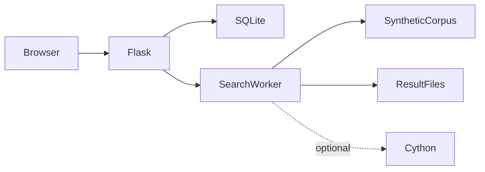

# بنية البحث النصي المحلي

ينشئ المستخدم بحثاً بعد الدخول ← يمسح العامل المجموعة الاصطناعية ← تُحدَّث الوظيفة والنتائج ← يتصفح المالك أو ينزل النتائج ← تراجع الإدارة الاستخدام.

## القرارات والمفاضلات

- تُضبط مسارات المجموعة والقاعدة والنتائج من وحدة واحدة بدلاً من مجلد Downloads خاص بجهاز. تستخدم المصادقة والواجهة القاعدة نفسها.
- يتجنب mmap تحميل الملف كله كنص Python. خفض حالة حروف البايتات ليس معالجة Unicode شاملة.
- يستخدم Windows مسار الخيوط وتبقى شيفرة تعدد العمليات للمنصات الأخرى. تُوصف النتائج حسب النظام المقاس.
- فُصلت حزم Telegram والتسريع عن تثبيت Flask الأساسي لتفعيلها بقصد.
- يحفظ متغير بيئة مفتاح الجلسة؛ توليد مفتاح جديد عند التشغيل يبطل الجلسات السابقة.

## مراجع الشيفرة

- [config.py](../config.py)
- [app.py](../app.py)
- [auth.py](../auth.py)
- [search_engine.py](../search_engine.py)
- [database.py](../database.py)
- [search_engine_cython.pyx](../search_engine_cython.pyx)

## الحدود

لا ندعي تسريعاً غير مقاس أو معالجة تيرابايت. يتطلب التسريع مترجماً. يحتاج التعافي من وظائف منقطعة والأنظمة الأخرى إلى فحوص مستقلة.
