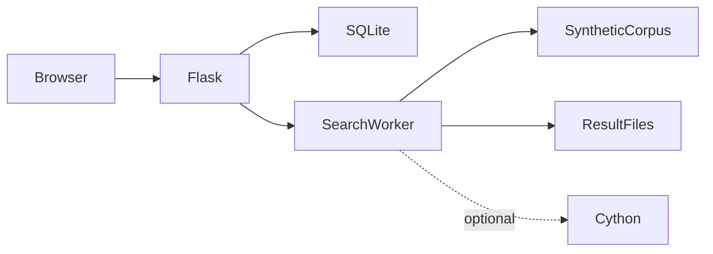

# Local Text Search architecture

Authenticated user creates a search → worker scans configured synthetic corpus → job progress and output file are updated → owner browses/downloads results → administrator reviews usage.

## Decisions and tradeoffs

- Corpus, database and output directories resolve through one module instead of the old machine-specific Downloads path. Authentication and web handlers must use the same database.
- mmap avoids loading each entire file into a Python string. Case-insensitive matching currently lowers byte strings; this is not general Unicode case folding.
- Windows uses the threaded worker path; other platforms retain multiprocessing-related code. Describe measured behavior on the tested OS.
- Optional Telegram and acceleration packages are split from the minimal Flask install. Enabling one integration should be deliberate.
- Session secrets can persist through an environment value; generating a new key at restart invalidates existing sessions.

## Component boundaries

| Component | Responsibility |
|---|---|
| `app.py` | Flask routes, job orchestration and result views |
| `search_engine.py` | mmap scanning and worker selection |
| `database.py` | SQLite users/jobs/results metadata |
| `auth.py` | bcrypt and role helpers |
| `search_engine_cython.pyx` | Optional accelerated matching |
| `bootstrap_demo.py` | Synthetic corpus/admin bootstrap |

## Source evidence

- [config.py](../config.py)
- [app.py](../app.py)
- [auth.py](../auth.py)
- [search_engine.py](../search_engine.py)
- [database.py](../database.py)
- [search_engine_cython.pyx](../search_engine_cython.pyx)

## Limits

No unsupported speedup or terabyte-scale claim. Native acceleration needs a compiler. Interrupted-job recovery and non-Windows behavior require their own checks.
